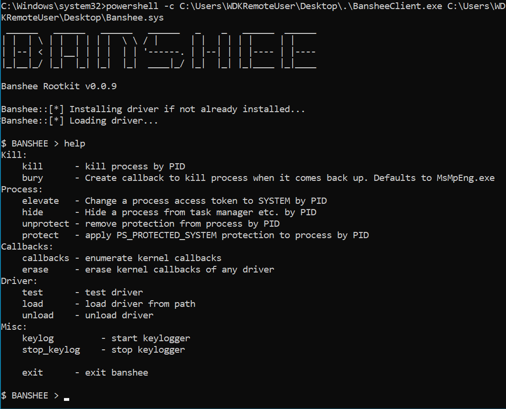

# Banshee

<p align="center">

</p>

Learning about Windows rootkits lately, so here is my own implementation of some techniques. For an overview, see **Features** below.

This is not ready to use as the code is bad and I am just learning about kernel driver development, so this is for educational purposes mainly.

## What is a Rootkit?

http://phrack.org/issues/55/5.html

## Usage

You can integrate Banshee into your tooling, by including the `Banshee.hpp` file in your project, e.g.:

```c++
Banshee banshee = Banshee();
banshee.Install(driverPath);
banshee.Initialize();

int targetPid = GetDefenderPID();    // this would be your implementation
banshee.IoCtlKillProcess(targetPid); // instruct banshee to kill the targetprocess
```

An example implementation of all the features in a command line client is found in [./BansheeClient/BansheeClient.cpp](./BansheeClient/BansheeClient.cpp).



## Testing & debugging the driver

You need to enable testsigning to load the driver. I also recommend to enable debugging for the kernel.

Run the following from an administrative prompt and reboot afterwards:

```cmd
bcdedit /set testsigning on
bcdedit /debug on
```

Afterwards you can run the client, after compiling the solution, with e.g.:

```cmd
.\x64\Debug\BansheeClient.exe C:\Users\eversinc33\source\repos\Banshee\x64\Debug\Banshee.sys
```

Run this in a VM and create a snapshot. You will probably Bluescreen a lot when developing and can corrupt your system. Be warned.

## Features

*Get in everyone, we're going to Kernel Land!*

### Kill any process by PID

`ZwTerminateProcess` is simply called from kernel land to terminate any process.

### "Bury" a Process

Terminating processes, but they come back alive? Bury a process to avoid it to restart by setting a kernel callback to process creation.

If the target process is created, Banshee will set the `CreationStatus` of the target process to `STATUS_ACCESS_DENIED`.

The match is case insensitive on a substring - e.g. to block defender, run `bury` with `defender`, then `kill <defender pid>` and it won't come back anymore, since all process creation events with `defender` in the image full path will be blocked.

For this feature, `INTEGRITYCHECK` has to be specified when linking (https://learn.microsoft.com/en-us/cpp/build/reference/integritycheck-require-signature-check?view=msvc-170).

### Change protection level of any process by PID 

This is done by modifying the `EPROCESS` structur, which is an kernel object that describes a processes attributes. It also holds a value that specifies the protection level of the process. 

On my machine, that value can be found at offset `0x87a`:
 


We can directly modify this value (aka Direct Kernel Object Modification or DKOM), since we are operating in Ring 0.

The values for the different protection levels can be found e.g. in Windows Internals Part 1 (page 115 in the 7th edition (english)).

### Elevate any process token to SYSTEM

`EPROCESS` also holds a pointer to the current access token, so we can just make it point to e.g. the token of process 4 (`SYSTEM`) to elevate any process to `SYSTEM`.

### Hide Process by PID

Again, `EPROCESS` comes to help here - it contains a `LIST_ENTRY` of a doubly linked list called `ActiveProcessLink` which is queried by Windows to enumerate running processes. If we simply unlink an entry here, we can hide our process from tools like Process Monitor or Task Manager.

* This can cause Bluescreens, e.g. when the process is closed while being hidden or due to patchguard scanning the kernel memory.

## TODO

* Shellcode injection from kernel land
* ETW provider disabling à la https://securityintelligence.com/posts/direct-kernel-object-manipulation-attacks-etw-providers/
* Registry key and file protection
* MSR hooking à la https://www.cyberark.com/resources/threat-research-blog/fantastic-rootkits-and-where-to-find-them-part-1
* GPU shenanigans
* Usability, refactor driver to C++
* Communication over direct TCP to bypass `netstat` and others
* Locks, dereferencing, ... - stability basically
* Hiding only on special ocassion, e.g. on opening of task manager, to avoid patchguard crashes
* Backdoor authentication as described in the phrack article linked above

## Credits

* Some offset code from: https://github.com/Idov31/Nidhogg 
* Great introduction to drivers: https://www.codeproject.com/articles/9504/driver-development-part-1-introduction-to-drivers
* Great overview of techniques: https://www.cyberark.com/resources/threat-research-blog/fantastic-rootkits-and-where-to-find-them-part-1
* WinDbg and the Windows Internals book for helping me (kinda) understand what I am doing here lol
